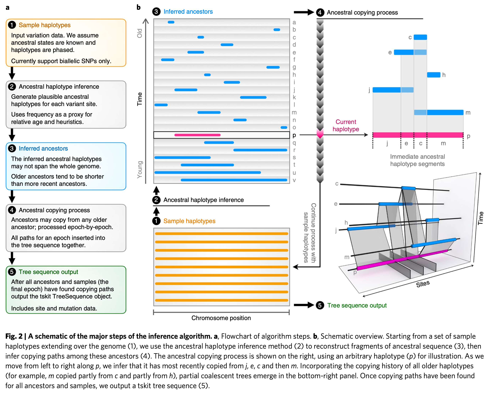
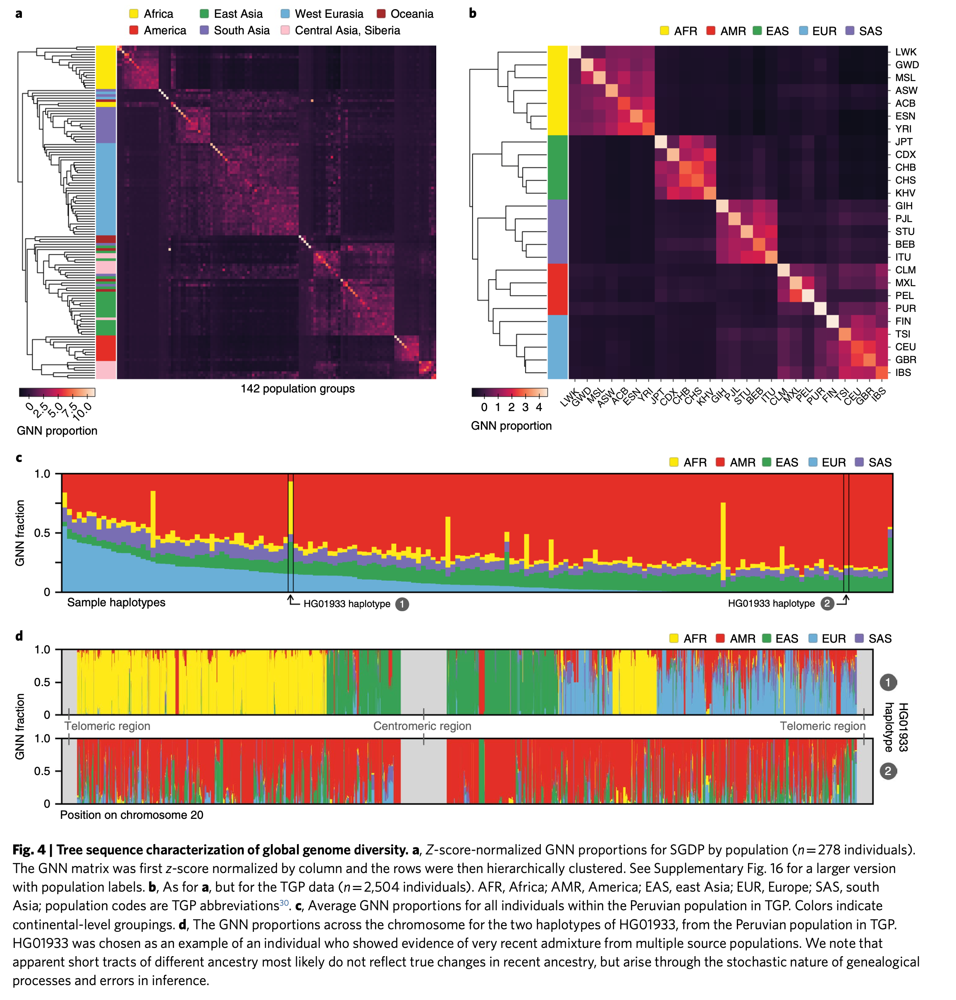
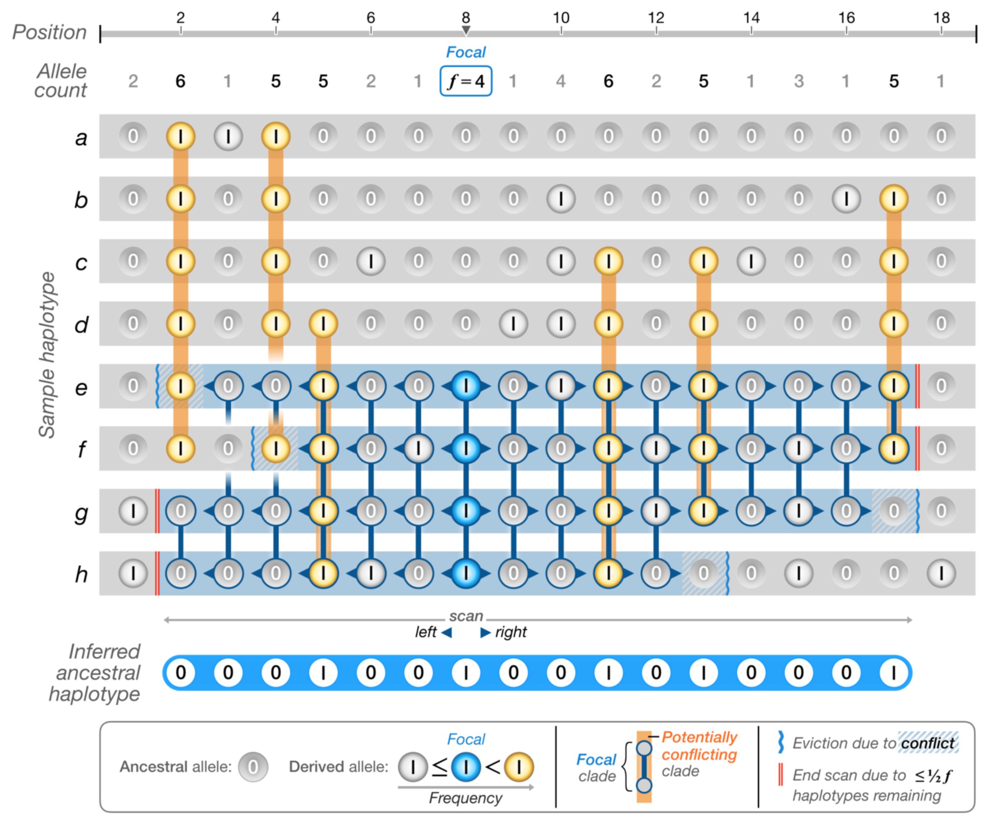
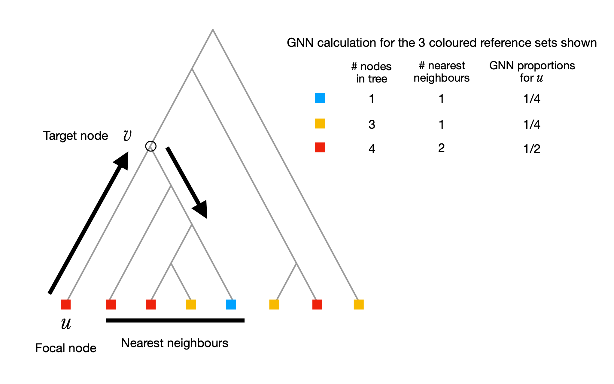

```{r setup, include=FALSE}

knitr::opts_chunk$set(fig.retina = 3)

options(htmltools.dir.version = FALSE)

xaringanExtra::use_xaringan_extra(c("tile_view", "tachyons"))
xaringanExtra::use_editable(expires = 1)

library(tidyverse)
library(xaringanthemer)

style_mono_accent(
  base_color = "#000000",
  header_font_google = google_font("Cabin"),
  text_font_google   = google_font("Noto Sans")
)
```

background-image: url(figures/title.png)
background-position: center
background-size: 75%


<!-- set style for all following captions --> 
<style>
p.caption {
  font-size: 0.6em;
  font-style: italic;
}
</style>

???
Hi everyone. Please interrupt me anytime if you'd like to ask something.  

Today, I'd like to present this article by Kelleher and colleagues which was published last year and carries the title "Inferring whole-genome hisories in large population data sets"

---
class: center, middle

# What does this **Title** reveal?

???
What does it reveal about the contents of the article?  

As it turns out quite a lot.  

Let's have a look at it bit-by-bit.


---


## .bg-washed-red.b--light-red.ba.bw2.br3.ph2.pv1[Inferring] .moon-gray[.bg-near-white.b--moon-gray.ba.bw2.br3.ph2.pv1[whole-genome] .bg-near-white.b--moon-gray.ba.bw2.br3.ph2.pv1[histories] in .bg-near-white.b--moon-gray.ba.bw2.br3.ph2.pv1[large population datasets]]

<br/>

```{r fig.cap="source: thesaurus.com", echo=FALSE, out.width="500px", fig.align="center"}

```

???
*Inferring* in this context means that:

The authors apply a model (result might therefore not be 100% accurate, but it's a **estimate/hypothesis**)  

---

## .moon-gray[.bg-near-white.b--moon-gray.ba.bw2.br3.ph2.pv1[Inferring]] .bg-washed-yellow.b--yellow.ba.bw2.br3.ph2.pv1[whole-genome] .moon-gray[.bg-near-white.b--moon-gray.ba.bw2.br3.ph2.pv1[histories] in .bg-near-white.b--moon-gray.ba.bw2.br3.ph2.pv1[large population datasets]]

```{r fig.cap="source: National Human Genome Research Institute", echo=FALSE, out.width="400px", fig.align="center"}
knitr::include_graphics("figures/Karyotype.png")
```

???
Next, *whole-genome*  

Here they work with whole-genome data from humans.  
The human genome (blueprint for an individual) consists of 23 chromosome pairs (it's diploid), shown in this figure, which are made of DNA.  

DNA in turn consists of four bases (A, T, G, C) and the order of those bases (also called sequence) can be determined using DNA sequencing methods.  


---

## .moon-gray[.bg-near-white.b--moon-gray.ba.bw2.br3.ph2.pv1[Inferring] .bg-near-white.b--moon-gray.ba.bw2.br3.ph2.pv1[whole-genome]] .bg-washed-green.b--dark-green.ba.bw2.br3.ph2.pv1[histories] .moon-gray[in .bg-near-white.b--moon-gray.ba.bw2.br3.ph2.pv1[large population datasets]]

???
*Histories* in terms of DNA evolution.  

Over time the DNA sequence can change (evolutionary process).  
Observing these changes of the DNA allows us to reconstruct history (genealogy).  

A way to visualize this history is through phylogenetic trees.  

--

<br/>

```{r fig.cap="source: Kelleher et al., 2019", echo=FALSE, out.width="400px", fig.align="center"}

```

???
Let's look at the following scenario, an example of a phylogenetic tree:  
- we have gathered genetic sequence information of 5 individuals (*a-e*)
- we compare those 5 sequences with each other and list the differences (*orange diamonds*)
- based on those differences we can infer the history and common ancestors (*f-i*)  

This model therefore predicts, that the earliest common ancestor of those 5 individuals is *i*.  
On the left hand side there happened changes at position 5 and 1 which led to an individual *h* and so on.  

Most importantly, a tree can describe real biology.  
Nodes are individuals and edges are connections between them.

---

## .moon-gray[.bg-near-white.b--moon-gray.ba.bw2.br3.ph2.pv1[Inferring] .bg-near-white.b--moon-gray.ba.bw2.br3.ph2.pv1[whole-genome]] .bg-washed-green.b--dark-green.ba.bw2.br3.ph2.pv1[histories] .moon-gray[in .bg-near-white.b--moon-gray.ba.bw2.br3.ph2.pv1[large population datasets]]

<br/>

```{r echo=FALSE, out.width="800px", fig.align="center"}

```

???
As mentioned before, DNA can change over time (mutates).  

Such mutations here shown in red are derived from an ancestral sequence (in grey) or is passed on from either parent.  

As seen on the previous slide, we can use these mutations to reconstruct history.  

In this example we see a short (diploid) sequence of three individuals, two parents and a child.  

If we look at C1, it is likely inherited from P1.  
For C2 it's a bit more complex. In addition to the G6T mutation which was not observed before, the first half seems to come from P2 while the second half likely from M2.  

Unfortunately, in addition to mutations this is an example of another process which makes reconstructing history difficult: ...

---

## .moon-gray[.bg-near-white.b--moon-gray.ba.bw2.br3.ph2.pv1[Inferring] .bg-near-white.b--moon-gray.ba.bw2.br3.ph2.pv1[whole-genome]] .bg-washed-green.b--dark-green.ba.bw2.br3.ph2.pv1[histories] .moon-gray[in .bg-near-white.b--moon-gray.ba.bw2.br3.ph2.pv1[large population datasets]]

<br/>

```{r fig.cap="source: genome.gov",echo=FALSE, out.width="600px", fig.align="center"}

```

???
...Recombination  

Turns out that paternal and maternal genetic material can cross over (recombine) as depicted here  
As this happens over multiple generations, a mosaic is created.  

> Chromosomes can be thought of as mosaics made up of material inherited from multiple ancestors.  
> \- Wilder Wohns

Representing history with a single (accurate) tree is therefore not possible anymore.  
The different parts of the genome have different histories.  

**Special methods are needed to solve this issue, which is the main thing this article describes**


---

## .moon-gray[.bg-near-white.b--moon-gray.ba.bw2.br3.ph2.pv1[Inferring] .bg-near-white.b--moon-gray.ba.bw2.br3.ph2.pv1[whole-genome] .bg-near-white.b--moon-gray.ba.bw2.br3.ph2.pv1[histories] in] .bg-lightest-blue.b--blue.ba.bw2.br3.ph2.pv1[large population datasets]

<br/>

```{r sequencing-costs, fig.cap="source: genome.gov/sequencingcosts", echo=FALSE, fig.align="center", fig.height=6, fig.width=10, message=FALSE}

sequencing_cost <-
  read_csv("data/Sequencing_Cost_Data_May2020.csv")

sequencing_cost %>%
  ggplot(aes(x = Date, y = `Cost per Genome`)) +
  geom_line(size = 1.5, colour = "#357edd") +
  scale_y_log10(labels=scales::dollar_format(big.mark = "'"), limits = c(1E1, 1E8)) +
  theme_xaringan() +
  theme(axis.text = element_text(size = 14),
        axis.title = element_text(size = 17)) +
  labs(x = NULL, y = "Cost per Human Genome")

```


???
Last part of the title *large population datasets*  

In recent years, new methods were developed to sequence DNA much faster and cheaper.  

Cost per Human Genome decreased drastically and is now below $1'000.  
Note that the y-axis is shown as log scale! The decrease in price is enormous.

---

## .moon-gray[.bg-near-white.b--moon-gray.ba.bw2.br3.ph2.pv1[Inferring] .bg-near-white.b--moon-gray.ba.bw2.br3.ph2.pv1[whole-genome] .bg-near-white.b--moon-gray.ba.bw2.br3.ph2.pv1[histories] in] .bg-lightest-blue.b--blue.ba.bw2.br3.ph2.pv1[large population datasets]

<br/>

```{r data-sets, echo=FALSE, fig.align="center", fig.height=6, fig.width=10}
data_sets <-
  tribble(
    ~data_set, ~n,
    "Simons Genome Diversity Project", 277,
    "1000 Genomes Project", 2504,
    "UK Biobank", 487000
  )

data_sets %>%
  mutate(data_set = fct_reorder(data_set, desc(n))) %>%
  ggplot(aes(x = data_set, y = n)) +
  geom_segment(aes(xend = data_set, yend = 1), colour = "darkgrey", size = 2) +
  geom_point(fill = "#cdecff", colour = "#357edd", size = 6, stroke = 2, shape = 21) +
  geom_text(aes(label = scales::comma(n, big.mark = "'")), vjust = -0.7, size = 8, fontface = "bold", family = "Noto Sans") +
  scale_y_log10(labels = scales::comma_format(big.mark = "'")) +
  expand_limits(y = c(1, 1000000)) +
  coord_flip() +
  theme_xaringan() +
  theme(axis.text = element_text(size = 14),
        axis.title = element_text(size = 17)) +
  labs(x = NULL, y = "n")
```


???
A consequence of that is, that the size of available data sets grew at a high rate.  

Here shown are the sample numbers of the three data sets used for proof of concept for this article.  

With larger data sets, more efficient algorithms (in respect to speed and storage space) are needed.  

---
class: center
# Current situation

<br/>

.pull-left[ 
Tree
```{r fig.cap="source: Adapted from Morrison, 2016", echo=FALSE, out.width="400px", fig.align="center"}
knitr::include_graphics("figures/morrison_2016_tree.svg")
```
]

???
In order to understand their proposed solution, let's look at the situation so far.  

- There exist many methods to infer phylogenetic trees from genetic DNA sequences  
- They however exclude/neglect the possibility of recombination (by e.g. building (gene)trees from short fragments where recombination can be excluded, or assumed to be minimal)  


--
.pull-right[
Network
```{r fig.cap="source: Adapted from Morrison, 2016", echo=FALSE, out.width="400px", fig.align="center"}

```
]

???
If however, we don't want to neglect recombination events, a different data structure is needed.  

- A network can represent such structures -> as in e.g. an ancestral recombination graph (ARG)  
- ARGs are computationally expensive and therefore limited to a few tens of samples  
- ARGs are therefore rarely used in practice

---
class: center, middle

# What's the Author's proposed **Solution**?

???
There's clearly room for new methods which overcome the current limitations.

---
class: center, middle

```{r fig.cap="source: github.com/tskit-dev", echo=FALSE, out.width="400px", fig.align="center"}

```

???
The authors previously developed a new data structure and provided a library of tools to work with it.  
This data structure is called **tree sequence**.  

ts stands for tree sequence, but what is that?  
We saw what a tree is, so a tree sequence is multiple trees but lets look at it in more detail    

>The **tskit** library provides the underlying functionality used to load, examine, and manipulate tree sequences.  
>
>**tskit** has both a Python and C API (Application Programming Interface).


---
## tree sequence

.pull-left[ 

```{r fig.cap="source: Kelleher et al., 2018", echo=FALSE, echo=FALSE, out.width="400px", fig.align="center"}

```
]

???
How can we imagine a tree sequence?  

Equivalent to ancestral recombination graph (ARG)  
But there's one tree for each part of the genome (separated by recombination events) since they have different ancestral histories  

For example:  
We have the DNA sequence information of three individuals (0-2)  
3 and 4 are ancestors, red stars are mutation events  

On the bottom we see a genome of length 10 where at position 5 recombination happened  
Since there's one recombination breakpoint, we can represent the data with two trees (shown on top)  

--

.pull-right[

```{r fig.cap="source: Kelleher et al., 2018", echo=FALSE, echo=FALSE, out.width="440px", fig.align="center"}

```
]

???
These trees can also be represented as the following data structure (everything which is needed is listed in those 4 tables)   
One can go from representation on the left to right and vice versa  
It's optimized for storage size use by discarding redundant information (succinct)  

This data structure allows that (Population genetics) statistics can be computed efficiently (eg. nucleotide diversity $\pi$) 

---
class: center, middle

# `tsinfer`

???
The work described in this article is based on this data structure
More specifically `tsinfer` (which is part of `tskit`)  

tsinfer is a method which makes use of tree sequence structure from genome variation data without the previously mentioned barriers of ARGs  

---

## Building ancestors and inferring edges

<br/>

```{r fig.cap="source: Kelleher et al., 2019", echo=FALSE, out.width="600px", fig.align="center"}

```

???
First, `tsinfer` builds/infers ancestral haplotypes (as shown here)  
these represent genomes of ancestors  

Second, haplotypes are arranged and edges (links between nodes) are inferred (trees are built)

Main thing is: `tsinfer` reconstructs trees (output is tree sequence)

---

## Comparison to state-of-the-art .pull-right[**Storage Space**]

```{r fig.cap="source: Kelleher et al., 2019", echo=FALSE, out.width="550px", fig.align="center"}

```

???
Space needed to store genomic variation data.  

VCF a popular format, stores the variants in matrices (see panel a), the complexity is O(n(nodes/samples) x m(variant sites))  

Tree sequence encoding on the other hand (shown in panel b) is more space efficient, the complexity is O(n(nodes) + m(variant sites) + r(recombinations/new nodes))  

As a result, file size of output remains much lower compared to VCF and is simmilar to Positional Burrows Wheeler Transform (PBWT) another recently developed data structure  

---

## Comparison to state-of-the-art .pull-right[**Accuracy** and **Speed**]

<br/>

.pull-left[
```{r fig.cap="source: Kelleher et al., 2019", echo=FALSE, out.width="470px", fig.align="center"}

```
]

.pull-right[
```{r fig.cap="source: Kelleher et al., 2019", echo=FALSE, out.width="500px", fig.align="center"}

```
]

???
comparable accuracy (using Kendall-Colijn (KC) metric, lower values indicate greater accuracy)   

and speed when compared to state-of-the-art

---
class: center, middle

# Application example

???
Where/how could ancestry inference be interesting?  

Ancestry inference is of fundamental biological interest, how did evolution happen?  

---

# UK Biobank population structure

```{r fig.cap="source: Kelleher et al., 2019", echo=FALSE, out.width="900px", fig.align="center"}

```

???
In this example the added information about the geographic origin of the individuals and plotted a heat map which shows the genealogical nearest neighbors.  

As expected, people from certain areas seem to be connected to others from a similar area.  

The authors have shown, on this large, real data set, that their method `tsinfer` returns a reasonable result and fulfills the aim of an efficient algorithm.  

---

# Limitations

<br/>

### assumed each mutation has a single origin

???
no independant (same) mutation events assumed (no homoplasic substitutions), recurrent and back mutations will (currently) not be handled well  

--

### mutation/recombination ratio has to be sufficiently high

???
more mutations compared to recombinations, in order to use mutations as starting point for ancestor inference  
If there's no mutation, we can't predict recombination events (they are a marker for it)

--

### only ordering of tree nodes (relative age)


???
result is only relative age  
methods for dating genomic variants could be used (see next slide)

---

# Drawbacks
.center[
## **Cladogram** vs. **Phylogram** vs. **Chronogram**
]

<br/>

```{r fig.cap="source: Riutort, 2016", echo=FALSE, out.width="800px", fig.align="center"}

```

???
The current output of `tsinfer` is a cladogram. Meaning nodes are arranged relative to each other but not according time or nucleotide differences.  

---

# Outlook
### From topologies to branch lengths (`tsdate`)

???
There's already ongoing work to implement this by one of the Authors (Wilder Wohns)

--

### Improved sequencing technologies

???
accurate long-read sequencing data could improve the method in the future  
(better phasing)

--

### Possible application for genomes of other Species

.pull-left[ 

```{r echo=FALSE, out.width="600px", fig.align="center"}

```
]

.pull-right[

```{r echo=FALSE, out.width="600px", fig.align="center"}

```
]

???
Not restricted to human genomes, applied to *P. vivax* Genome Variation Project, also possible to apply for Viral genomes?!  
The need seems to be present since viruses also recombine/reassort, see those two examples    

---
class: center, middle

## .bg-washed-red.b--light-red.ba.bw2.br3.ph2.pv1[Inferring] .bg-washed-yellow.b--yellow.ba.bw2.br3.ph2.pv1[whole-genome] .bg-washed-green.b--dark-green.ba.bw2.br3.ph2.pv1[histories] in .bg-lightest-blue.b--blue.ba.bw2.br3.ph2.pv1[large population datasets]

???
In this article, the Authors present a method to do better inference of genetic histories by also considering recombination events of genomes.  

In addition to good accuracy compared state-of-the-art tools, `tsinfer` is also very well scalable, fast and space efficient.  

They even argued that it's therefore hypothetically even possible to "Infer the ancestry of everyone" as the title of their preprint was modestly called

---

background-image: url(figures/infer_the_ancestry_of_everyone.png)
background-position: center
background-size: 40%

???
With that modest goal, I'd like to finish and am happy to receive questions

---

---
class: center, middle

# Appendix


---
# (Dis)Advantages of open source code and data

.pull-left[
### &#x1f44d;

.can-edit.key-likes[
- replicability of results  
- 
]
]

.pull-right[
### &#x1f44e;

.can-edit.key-dislikes[
- sensitive data not protected  
- 
]
]
---
class: center, middle

```{r fig.cap="source: Kelleher et al., 2019", echo=FALSE, out.width="700px", fig.align="center"}

```

---
class: center, middle

```{r fig.cap="source: Kelleher et al., 2019", echo=FALSE, out.width="500px", fig.align="center"}

```

---
class: center, middle

```{r fig.cap="source: Kelleher et al., 2019", echo=FALSE, out.width="700px", fig.align="center"}

```

---
class: center, middle

```{r fig.cap="source: Kelleher et al., 2019", echo=FALSE, out.width="700px", fig.align="center"}

```

---
class: center, middle

```{r fig.cap="source: Kelleher et al., 2018", echo=FALSE, out.width="700px", fig.align="center"}

```
 
???

Original tree vs. minimal tree (listing only current-alive individuals and their ancestors) 
